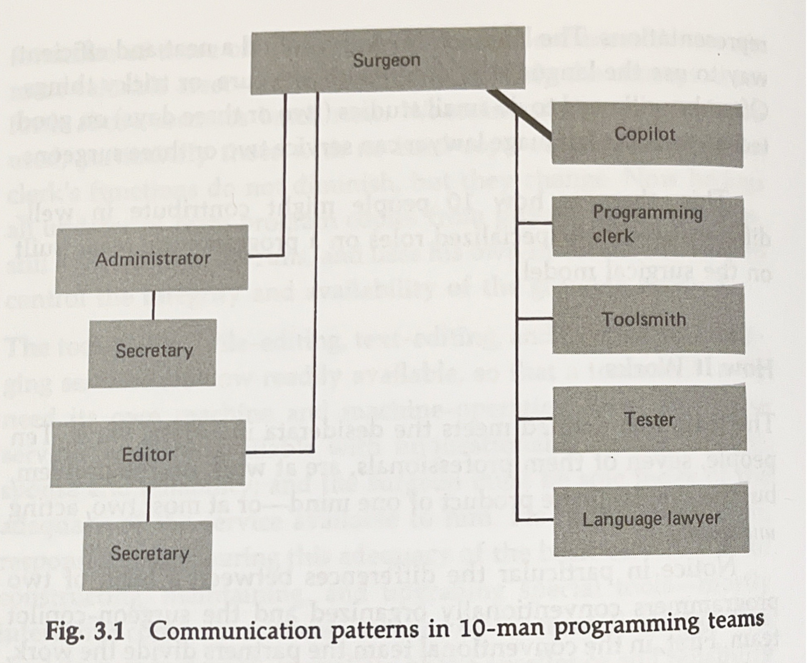

 <!-- .element style="height: 580px; margin: 0 auto 4rem auto; background: transparent;" -->

---

<!-- .slide: style="font-size:25px;" -->

## Context

We have a team of software developers. We've been asked to come up with a strategy on how we can double the throughput. Budget is doubled and it looks like we're in a position where we also have access to double our capacity.

But the problem we're facing is the one Fred Brooks formulated in "The Mythical Man-month"; Brooks Law:

<q>Adding more people to a project that is late,  makes it later</q>.

The hole is simply not big enough to fit more diggers. The manoeuver room is too tight.

---

<!-- .slide: style="font-size:25px;" -->

## Context

### ...continued

We have two senior developer who over the past 10 months has build up valuable business knowledge and established good contacts with end-users at the customer.

Our plan is to split the team in two (with a reference to Fred Brook's surgical teams) an make the work in parallel. Brook argues in his _"No Silver Bullet essay"_. That the only thing that can overcome the inherit complexity in software and speed up throughput is either to **_reuse more code_**, or to (truly)**_work in parallel_**.

You can't rush a pregnancy ...but two women can be pregnant at the same time.

---
---

## The Two-Team Structure

The new structure should consist of two specialized teams, each with a specific focus and composition, led by one of your senior developers. The senior developers will act as the **"surgeons"** in Brooks' analogy.

---

<!-- .slide: style="font-size:25px;" -->

## Team A (The Surgical Team)

- **Leader**: Senior Developer 1 (The "Surgeon"). This person will be responsible for the core design and implementation of the most complex, critical parts of the business logic.

- **Composition**: A small, highly skilled group of 4 developers. This team will be the primary producers of code. The key is to keep this team small to maintain high productivity and low communication overhead.

- **Focus**: Core business logic development. This team will focus on the most difficult parts of the supply chain management system where deep business knowledge is required.

---

<!-- .slide: style="font-size:25px;" -->

## Team B (The Support Team)

- **Leader**: Senior Developer 2 (The "Co-Pilot" or "First Assistant"). This person will manage the support functions and parallel work streams.
- **Composition**: The remaining 4 developers. This team will handle tasks that are more separable and can be worked on in parallel without constant communication with Team A.
- **Focus**: Non-core, parallelizable tasks. This includes:
  - **Integration**: Handling APIs, data feeds, and integrations with other systems.
  - **User Interface (UI) development**: Building the front-end components.
  - **Automated testing and QA**: Developing test suites and managing quality assurance.
  - **Tooling and Infrastructure**: Building internal tools and managing the development environment.
  - **Documentation**: Writing technical and user documentation.

---

<!-- .slide: style="font-size:30px;" -->

## The Role of the Senior Developers

The two senior developers are the linchpin of this plan. They act as the "surgeons" and "co-pilots," respectively.

- **Senior Developer 1**: takes on the most difficult, central tasks. Has deep business knowledge. Invaluable for making critical architectural decisions and ensuring the core logic is correct. Work directly with the small team, to ensuring a coherent and high-quality core product.
- **Senior Developer 2**: is equally crucial. Will manage the parallel work, ensuring the two teams' efforts are coordinated. Act as the main point of contact for external stakeholders and manage the flow of information between the teams. Frees up Senior Developer 1 to focus on the core product without interruption.

Note:

This structure allows for a true doubling of capacity by having two separate, but coordinated, work streams. The high-communication-overhead tasks are concentrated within the small Team A, while the more independent, parallelizable tasks are handled by Team B. This directly addresses Brooks' argument that to truly double throughput, you must enable parallel work, which is exactly what this model achieves. It acknowledges that not all work requires the same level of close collaboration and leverages your team's existing expertise and customer relationships effectively.

---

## If it quarks like a 🦆  

So one team is specifically designed to make the other team go faster (support). 
This spawns discussions:

<q>How are "surgical team" different?</q>

- should we specialize in a back-end and a front-end team? or
- should we have two (autonomous) full stack teams?

---

<!-- .slide: style="font-size:30px;" -->
## Why Not Specialized or Full-Stack Teams?

**Specialized Back-end/Front-end Teams**: This structure creates a high-friction communication bottleneck. The front-end team is often dependent on the back-end team, leading to delays and constant coordination meetings. This model suffers from Conway's Law, which states that systems reflect the communication structures of the organizations that build them. **The result is a rigid, divided system rather than a cohesive one**.

**Autonomous Full-stack Teams**: While this model promotes autonomy and reduces inter-team communication, it struggles with conceptual integrity. When multiple full-stack teams work on different parts of the same system, their independent decisions can lead to a fragmented, inconsistent design. There's no single mind ensuring the architecture is coherent and elegant. **This can result in a bloated, complex system that's difficult to maintain**.

---

## The Surgical Team: A Different Approach

The core idea of the surgical team is to centralize the most important work and decision-making in the hands of a single, highly skilled developer—the "surgeon". The rest of the team exists to amplify the surgeon's productivity and maintain conceptual integrity. This structure is a direct response to the complexity of software and the communication overhead that slows down large teams.

Note:

Here's how the roles break down in your context:

The Surgeon (Senior Developer 1): This person is your expert in the business logic. They don't get bogged down in administrative tasks, infrastructure, or low-level implementation details. They're responsible for the core design and implementation of the most complex parts of the system. Their deep knowledge of the customer's supply chain is the "silver bullet" Brooks talks about—the essential expertise needed to solve the problem's inherent complexity.

The Co-pilot (Senior Developer 2): This person acts as the surgeon's alter ego. They are equally skilled and knowledgeable about the system but focus on support roles. They can take on parallel, non-critical work streams, manage the support team, and handle communication with external stakeholders. Their role is to ensure the surgeon is never blocked and can focus entirely on the core task.

The Support Team (The other 6 developers): This is where your remaining developers fit in. Their roles are specialized to support the surgeon and co-pilot. They handle tasks that can be broken down and worked on in parallel without constant communication with the core team. This includes things like:

Toolsmiths: Building and maintaining automated testing, CI/CD pipelines, and other developer tools.

Testers: Creating and running test suites to ensure the core logic is sound.

Librarians: Managing documentation, code repositories, and version control.

Integrators: Building the front-end and back-end integration points, ensuring the system works as a whole without disrupting the core logic development.

This structure allows for a true doubling of capacity, not by adding more hands to the same task, but by enabling parallel work on distinct, separable components. It's not about two teams doing the same thing; it's about one team (the surgical team) doing the most critical work while a second team (the support team) ensures they can do it at maximum speed. This model is built on the principle that the most productive work happens when a single, brilliant mind is allowed to focus without distraction.

---

<!-- .slide: style="font-size:30px;" -->

## Fluid vs fixed

The developers in a "surgical team" are not fluidly moving between teams. In fact, their roles are quite fixed and specialized, designed to maximize the productivity of a single, highly skilled individual—the "surgeon."

The "Surgical Team" is a Fixed Hierarchy

Brooks's "surgical team" is a specific, hierarchical structure with defined roles. It’s not about two separate, autonomous teams. It's about a single team of specialists who exist to support the "surgeon" (your senior developer) so they can focus entirely on the core, complex work. The other members are not "full-stack" developers who could take over the surgeon's role, but rather specialized assistants who perform the necessary support tasks.

Note:

Here's the breakdown of the fixed roles:

Surgeon: The single, chief programmer. They are responsible for the entire program's conceptual integrity. They design, code, and test the most critical components. Their role is not a temporary assignment; it is the core of their function.

Co-pilot: The surgeon's "alter ego." This person is almost as skilled as the surgeon and is intimately familiar with all the code. They can discuss design alternatives, act as a sounding board, and step in if the surgeon is unavailable.

Administrator: Handles administrative tasks like personnel, budget, and office space. This is to shield the surgeon from distractions.

Editor: Takes the surgeon's documentation and prepares it for publication.

Toolsmith: Builds and maintains the software tools needed by the team, like build systems and test frameworks.

Tester: A dedicated person or small group for formal testing.

Librarian: Manages all of the project's technical records, including code, documentation, and data.

The model is predicated on the idea that the productivity of the best programmer is an order of magnitude higher than the average, and therefore the goal is to unblock that individual completely. The entire team's function is to create a frictionless environment for the surgeon to work in.

---
---

## "What could possibly go wrong"?

What are the most common pitfalls, in trying to implement this model In lean terminalogy:

- What could create **mura** (unevenness)
- What could create **muri** (overburdenness)
- What could create **muda** (wastefullnes)

What needs to be true, for this team to be a success?

---

<!-- .slide: style="font-size:30px;" -->

## Mura (Unevenness) - What Could Go Wrong?

Unevenness in a surgical team model comes from a fundamental imbalance of skills, tasks, or information flow.

**Uneven Workloads**: The model creates a single point of failure and bottleneck in the Surgeon. If their work is not adequately supported or if they are pulled into non-core tasks (like meetings, admin, or low-level coding), the entire team's flow will stop. Conversely, the support staff could be idle while waiting for the Surgeon to complete a task.

**Knowledge Silos**: The deep conceptual knowledge resides almost exclusively with the two senior developers. If the "co-pilot" is not truly a capable substitute, or if they are not kept in the loop on all critical decisions, you create a major risk. A sick day or a departure from either senior developer could halt progress entirely.

**Inconsistent Quality**: The model is built on the assumption that the Surgeon's work is of superior quality. If the Surgeon is not truly a "10x" developer, the rest of the team's work will be based on a flawed foundation, leading to a cascade of defects.

---

<!-- .slide: style="font-size:30px;" -->

## Muri (Overburden) - What Could Go Wrong?

Overburden happens when a person or system is pushed beyond its capacity, leading to stress, burnout, and mistakes.

- **Overburdened Surgeon**: The single biggest risk is overwhelming the Surgeon. By design, they are responsible for all critical decisions and core code. Too much pressure, interruptions, or an unmanageable scope will lead to burnout and poor architectural choices. The whole model is useless if the Surgeon is not operating at peak efficiency.
- **Overburdened Support**: The support roles (librarian, toolsmith, etc.) may be tasked with more than one full-time job. This can lead to low-quality work and mistakes that ultimately slow down the entire team. A developer acting as a "toolsmith" while also helping with testing may become a bottleneck themselves.

---

<!-- .slide: style="font-size:30px;" -->

## Muda (Wastefulness) - What Could Go Wrong?

Waste in a surgical team model is anything that does not add direct value to the final product.

- **Waste of Waiting**: The most common form of waste is the waiting created by the central bottleneck of the Surgeon. If the support team is waiting on a decision, a code review, or a build from the Surgeon, that's pure waste.
- **Waste of Defects**: A flaw in the Surgeon's core design will lead to extensive rework and defects that multiply throughout the system. This waste is a direct consequence of a lack of checks and balances in the core decision-making process.
- **Waste of Underutilized Talent**: The model relies on a fixed, hierarchical structure. If a junior developer on the support team has a brilliant idea for the core design, it may be dismissed because their role is not to contribute to the central architecture. This squanders creativity and limits learning.

---

<!-- .slide: style="font-size:25px;" -->

## What Needs to Be True for Success?

For this model to work, the following must be true:

- **The "Surgeon" is a True Expert**: You must have a senior developer who is not only technically brilliant but also has the conceptual integrity and deep business knowledge to own the entire design. Without this, the model will fail.
- **Specialized Roles are Respected**: The other team members must be willing to accept their support roles. The team needs to have mutual respect and trust in the Surgeon's leadership, knowing that their specialized work is crucial to the project's success.

---

<!-- .slide: style="font-size:25px;" -->

## What Needs to Be True for Success?

### ...continues

- **Clear Communication and Documentation**: The two senior developers must maintain constant, clear communication. The Surgeon's decisions and rationale must be meticulously documented by the "librarian" to ensure the entire team understands the "why" behind the core design. This prevents miscommunication and reduces rework.
- A Well-Defined Scope: The project must have a single, well-defined goal that a few minds can conceptualize. The model is not suitable for vague or rapidly changing requirements.
- **A Culture of Trust, Not Ego**: The Surgeon must lead with competence, not arrogance. The success of the team depends on a collaborative environment where every role is valued, and the Surgeon listens to feedback from their specialists. The goal is a highly functional organism, not a dictatorship.
