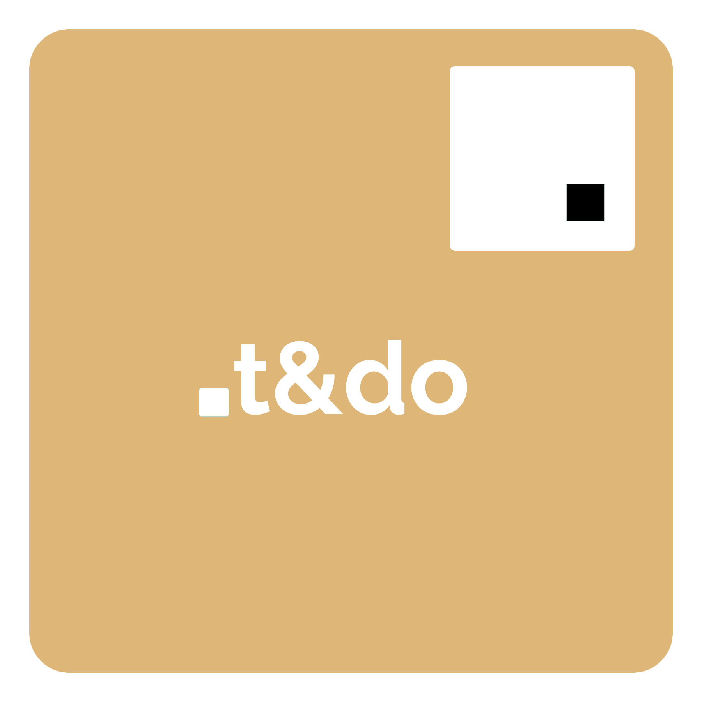
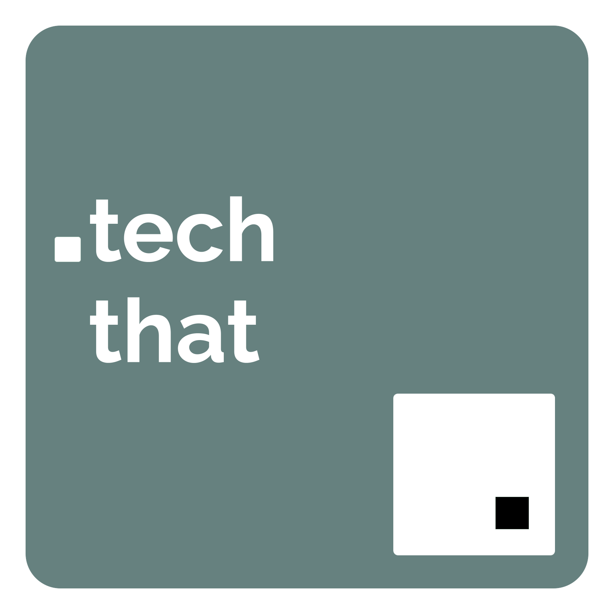
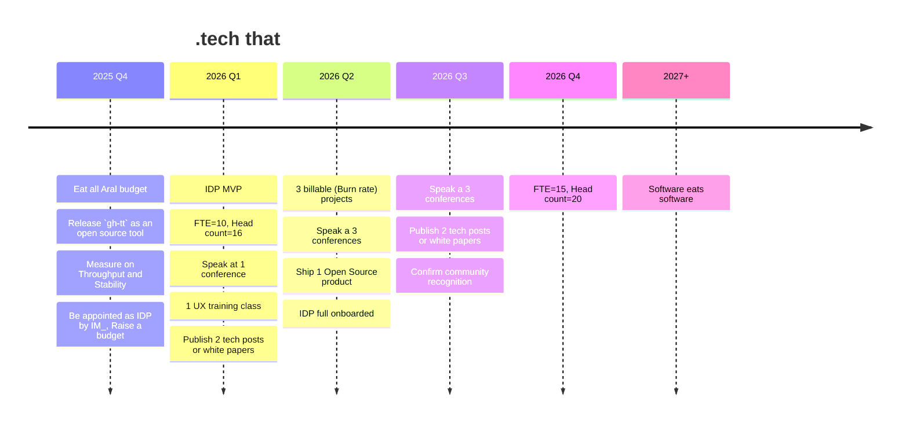

<!-- .slide: data-background="#111111" -->

[<!-- .element style="height: 180px; margin: 0 auto 4rem auto; background: transparent;" -->](https://reveals.thetechcollective.dev/markdownloader/?owner=thetechcollective&repo=presentations&file=ttc-vision.md) 

Compliant with the `markdownloader` 
click the logo to see it live!

---
---

<!-- .slide: data-background="#64505a" -->
 <!-- .element style="height: 180px; margin: 0 auto 4rem auto; background: transparent;" -->
 <!-- .element style="height: 450px; margin: 0 auto 4rem auto; background: transparent; align: left;" -->

---

<!-- .slide: data-background="#64505a" -->

 <!-- .element style="height: 180px; margin: 0 auto 4rem auto; background: transparent;" -->

<q>We want to be be recognized as the one-stop partner for (wicked) problem-solving across the full SDLC, by leveraging both advisory- and implementation services</q>
<!-- .element style="color:white;" -->

Note:
This is trying to embrace the _big we_ including _all_ of .t&do but clearly we're speaking from _our_ (.tech that) perspective. Software is eating the world, we need more software!

All we do collectively in .t&do; 

- Test automation
- Test management
- Experience design
- Software Product Development

...has only **_one_** underlying bridge that unites us: Software deliveries!

A joint vision statement _must_ revolve around _software something_

---

<!-- .slide: data-background="#af9eb5" -->

 <!-- .element style="height: 180px; margin: 0 auto 4rem auto; background: transparent;" -->

"We aim to be widely recognized as the most optimized Continuous Delivery team in Denmark.
Building GxP grade software products in close collaboration with end-users<!-- .element class="fragment" -->
— while maintaining high throughput.<!-- .element class="fragment" -->
Our client relations should be based on mutual trust"<!-- .element class="fragment" -->
<!-- .element: style="color:white;font-style:italic;" -->

Note:

- Our team output as well as process should be recognized as _elite_ on the DORA scale,
- Mastering
  - Continuous Delivery
  - Stellar DevEx
  - Short feedback loops
  - High throughput and high stability
  - Transformational leadership

---
---

# Services
<!-- .slide: data-background="./assets/techthat.png" data-background-size="100px" data-background-position="bottom 20px left 20px" -->

We have several thing we believe we can _potentially_ deliver. And consequently make the foundation of our business model. Each service requires separate strategy and tactics.

Note:
The more services we deliver the more strategies we must develop and optimize. For a smaller team with limited bandwidth it makes sense to focus-

---

# Explore vs Exploit
<!-- .slide: data-background="./assets/techthat.png" data-background-size="100px" data-background-position="bottom 20px left 20px" -->

- **Explore** 
Use a Lean Product Development approach – based on a runway budget – to develop and validate a product market fit

- **Exploit**
When market fit is validated, formalize the product delivery

---

<!-- .slide: data-background="./assets/techthat.png" data-background-size="100px" data-background-position="bottom 20px left 20px" -->

# Eric Rice
#### Note to self...
On **explore**. vs **exploit**

<q>Dear Eric, thank you for your service to this company. Unfortunately, the job you have been doing is no longer available, and the company you used to work for no longer exists. However, we are pleased to offer you a new job at an entirely new company, that happens to contain all the same people as before. This new job began months ago, and you are already failing at it. Luckily, all the strategies you’ve developed that made you successful at the old company are entirely obsolete. Best of luck!</q>
<!-- .element: style="font-size:25px;" -->

Quote from Lean Enterprise<!-- .element: style="font-size:15px;font-style:italic;text-align:left" -->

---
---

### .tech that - burn rate

<!-- .slide: class="bmc" -->

- Freelancers
- Academia — Interns
- Implement

<!-- .element class="bmc-partners" -->

- Hack hack (Solutions)
- TGIF (kaizen)
- Workshops (Problems)

<!-- .element class="bmc-activities" -->

- .ttc employees

<!-- .element class="bmc-resources" -->

- GxP grade software development
- DORA Elite
- _We build it – We run it!_
- Hypercare
- Continuous improvement (feature focus)

<!-- .element class="bmc-valueprop" -->

- House orchestra
- Trusted partners

<!-- .element class="bmc-relations" -->

- Community Karma
- Reputation
- Referral

<!-- .element class="bmc-channels" -->

- Business and mission critical
- Green Field (Big Dreams)
- Wicked Problems

<!-- .element class="bmc-segments" -->

- Salaries
- Equipment
- Licenses
- Training
- R&D

<!-- .element class="bmc-cost" -->

- Invoicing

<!-- .element class="bmc-revenue" -->

Note:
Each viable value proposition requires a separate M:A:R:S. strategy

- **Marketing**
- **Account management**
- **Recruitment and retention**
- **Sales**

---

<!-- .slide: data-background="./assets/techthat.png" data-background-size="100px" data-background-position="bottom 20px left 20px" -->

## .tech that - burn rate

| | |
|-|-|
|**Marketing** | Community reach out, public presence, speaks, blogs, podcasts, Open Source tools  <!-- .element: style="font-size:20px;"--> |
|**Account management** | Build close partner-like relations, establish trust <!-- .element: style="font-size:20px;"--> |
|**Recruitment & retention** | Approach academia, Screen hard, Engage, Be genuine DevX, Transofrmational Leadership  <!-- .element: style="font-size:20px;"--> |
|**Sales** | Up-selling, referrals, Workshops, In-bound  <!-- .element: style="font-size:20px;"--> |
|
<!-- .element: style="font-size:25px;"-->

---
---

## .tech that - IDP

<!-- .slide: class="bmc" -->

- The Tech Collective
- Implement
- IM_ IT dept.

<!-- .element class="bmc-partners" -->

- Hack hack (Solutions)
- Hackathons (feedback loops)
- Workshops (Problems)

<!-- .element class="bmc-activities" -->

- .tech that

<!-- .element class="bmc-resources" -->

- Self-service infrastructure
- Templates and standards
- _Paved road_
- Community

<!-- .element class="bmc-valueprop" -->

- IDP community leads
- Friendly, helpful instructors and advisors

<!-- .element class="bmc-relations" -->

- Community
- Hackathons
- Customer voice

<!-- .element class="bmc-channels" -->

- Engineers in .ttc & IM_
- IT, Legal, CIO

<!-- .element class="bmc-segments" -->

- Salaries
- Equipment
- Licenses
- Training
- R&D

<!-- .element class="bmc-cost" -->

- Funding (IM_)

<!-- .element class="bmc-revenue" -->

---

## .tech that - IDP

<!-- .slide: data-background="./assets/techthat.png" data-background-size="100px" data-background-position="bottom 20px left 20px" -->

| | |
|-|-|
|**Marketing** | Build internal community, Hackathons  <!-- .element: style="font-size:20px;"--> |
|**Account management** | High availability, quick response, Customer Voice <!-- .element: style="font-size:20px;"--> |
|**Recruitment & retention** | Accusation, Be genuine, Engage   <!-- .element: style="font-size:20px;"--> |
|**Sales** | Use the IM_/.ttc IDP as a reference case  <!-- .element: style="font-size:20px;"--> |
|
<!-- .element: style="font-size:25px;"-->

---
---

## .tech that - DevX

<!-- .slide: class="bmc" -->

- Public Communities

<!-- .element class="bmc-partners" -->

- Open Source releases
- Hackathons (community events)
- R&D (Problems, needs market fits)

<!-- .element class="bmc-activities" -->

- .tech that

<!-- .element class="bmc-resources" -->

- DORA Elite is an achievable dream
- Transformational Leadership
- Configuration Management
- It works on _any_ machine

<!-- .element class="bmc-valueprop" -->

- Community leads
- Friendly, helpful instructors and advisors

<!-- .element class="bmc-relations" -->

- Community
- Training
- Advisory

<!-- .element class="bmc-channels" -->

- Engineers (community referrals)
- Large corporation (dev teams)

<!-- .element class="bmc-segments" -->

- Salaries
- Equipment
- Licenses
- Training
- R&D

<!-- .element class="bmc-cost" -->

- Training classes
- Advisory
- Open source contributions

<!-- .element class="bmc-revenue" -->

---

## .tech that - DevX

<!-- .slide: data-background="./assets/techthat.png" data-background-size="100px" data-background-position="bottom 20px left 20px" -->

| | |
|-|-|
|**Marketing** | Build internal community, Hackathons  <!-- .element: style="font-size:20px;"--> |
|**Account management** | High availability, quick response, Customer Voice <!-- .element: style="font-size:20px;"--> |
|**Recruitment & retention** | Accusation, Be genuine, Engage   <!-- .element: style="font-size:20px;"--> |
|**Sales** | Use the IM_/.ttc IDP as a reference case  <!-- .element: style="font-size:20px;"--> |
|
<!-- .element: style="font-size:25px;"-->

---
---

# Goals

